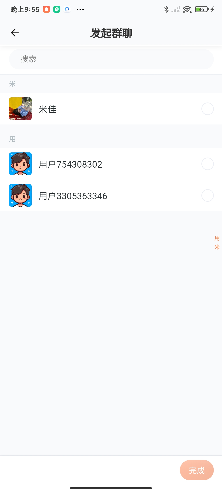

# 🦫 Beaver IM - 海狸即时通讯

[](LICENSE)
[](https://golang.org/)
[](https://qm.qq.com/q/82rbf7QBzO)
[]()

> 🚀 基于 Go-Zero + UniApp + Electron 构建的现代化即时通讯应用，支持移动端、桌面端多平台

## 📖 项目简介

Beaver IM（海狸IM）是一个功能完整的即时通讯应用，采用现代化的微服务架构构建。项目包含移动端（UniApp）、桌面端（Electron）和后端服务（Go-Zero），为用户提供流畅的聊天体验。

### ✨ 核心特性

- 🔐 **安全认证** - 用户注册、登录、密码找回、邮箱验证
- 👥 **社交功能** - 好友管理、群聊、二维码添加
- 💬 **即时通讯** - 私聊、群聊支持文本、图片、表情
- 🖼️ **多媒体支持** - 图片发送、头像上传
- 📱 **多端同步** - 移动端、桌面端数据实时同步
- 🔄 **实时通信** - WebSocket 长连接保证消息实时性
- 🎨 **现代化UI** - 简洁美观的用户界面
- 🏗️ **微服务架构** - 支持高并发、易扩展

## 🛠️ 技术栈

### 后端技术
- **Go-Zero** - 微服务框架
- **WebSocket** - 实时通信
- **MySQL** - 数据存储
- **Redis** - 缓存和会话管理
- **ETCD** - 服务发现

### 前端技术
- **UniApp** - 跨平台移动端开发
- **Vue 3** - 渐进式 JavaScript 框架
- **Electron** - 桌面端应用框架

## 📚 文档与教程

- 📖 **详细文档**: [https://wsrh8888.github.io/beaver-docs/](https://wsrh8888.github.io/beaver-docs/)
- 🎥 **视频教程**: [https://www.bilibili.com/video/BV1HrrKYeEB4/](https://www.bilibili.com/video/BV1HrrKYeEB4/)
- 📱 **演示包下载**: [v1.0.0.apk](https://github.com/wsrh8888/beaver-docs/releases/download/v1.0.0/1.0.0.apk)


## 🏗️ 服务架构

### 服务端口配置（每服务预留100个端口，支持多实例部署）
| 服务 | API基础端口 | RPC基础端口 | Admin基础端口 |
|:---------:|:--------:|:--------:|:--------:|
|user|20000|30000|40000|
|auth|20100|30100|40100|
|friend|20200|30200|40200|
|chat|20300|30300|40300|
|ws|20400|30400|40400|
|group|20500|30500|40500|
|file|20600|30600|40600|
|emoji|20700|30700|40700|
|gateway|20800|-----|40800|
|moment|20900|-----|40900|
|system|21000|-----|41000|
|config|21100|31100|41100|
|feedback|21400|-----|41400|
|track|21500|-----|41500|
|update|21600|-----|41600|


## 🚀 快速开始

### 环境要求

- Go >= 1.21
- MySQL >= 8.0
- Redis >= 6.0
- ETCD >= 3.5

### 安装步骤

1. **克隆项目**
```bash
git clone https://github.com/wsrh8888/beaver-server.git
cd beaver-server
```

2. **安装依赖**
```bash
go mod tidy
```

3. **启动基础服务**
```bash
# 使用 Docker Compose 启动 etcd、mysql、redis
docker-compose -f build/docker-compose.yaml up -d
```

4. **初始化数据库**
```bash
go run main.go -db
```

5. **启动服务**
```bash
# 需要先启动RPC服务后再启动API服务
# 具体启动命令请参考文档
```


## 🔗 相关项目

| 项目 | GitHub仓库 | Gitee仓库 | 说明 |
|------|------------|-----------|------|
| **beaver-server** | [beaver-server](https://github.com/wsrh8888/beaver-server) | [beaver-server](https://gitee.com/dawwdadfrf/beaver-server) | 后端服务 |
| **beaver-mobile** | [beaver-mobile](https://github.com/wsrh8888/beaver-mobile) | [beaver-mobile](https://gitee.com/dawwdadfrf/beaver-mobile) | 移动端应用 |
| **beaver-desktop** | [beaver-desktop](https://github.com/wsrh8888/beaver-desktop) | [beaver-desktop](https://gitee.com/dawwdadfrf/beaver-desktop) | 桌面端应用 |


## 📝 更新记录

### 2025-07-14
- ✅ 修正所有的端口号
- ✅ 增加邮箱登录和邮箱验证码
- ✅ 增加api和rpc字典服务
- ✅ 文件增加rpc服务
- ✅ 增加修改个人信息等接口
- ✅ 增加请求中间件
- ✅ 修复各种bug

## 📱 功能展示

### 🔐 用户认证
<div align="center">
  
  
  
</div>

### 💬 聊天功能
<div align="center">
  
  
  
</div>

### 👥 社交功能
<div align="center">
  
  
  
</div>

### 👤 个人中心
<div align="center">
  
  
  
</div>

### 🎯 其他功能
<div align="center">
  
  
  
  
  
</div>

## 📁 项目结构

```
beaver-server/
├── app/                    # 微服务应用
│   ├── auth/              # 认证服务
│   ├── chat/              # 聊天服务
│   ├── friend/            # 好友服务
│   ├── group/             # 群组服务
│   ├── user/              # 用户服务
│   ├── ws/                # WebSocket服务
│   └── ...                # 其他服务
├── common/                # 公共组件
├── core/                  # 核心配置
├── static/                # 静态资源
├── template/              # 代码模板
└── utils/                 # 工具函数
```

## 🤝 贡献指南

我们欢迎所有形式的贡献，包括但不限于：

- 🐛 Bug 报告
- 💡 功能建议
- 📝 文档改进
- 🔧 代码贡献

### 贡献步骤

1. Fork 本仓库
2. 创建特性分支 (`git checkout -b feature/AmazingFeature`)
3. 提交更改 (`git commit -m 'Add some AmazingFeature'`)
4. 推送到分支 (`git push origin feature/AmazingFeature`)
5. 开启 Pull Request

## 📄 开源协议

本项目基于 [MIT](LICENSE) 协议开源。

## 🆘 获取帮助

- 📧 邮箱：[751135385@qq.com]
- 💬 QQ群：[1013328597](https://qm.qq.com/q/82rbf7QBzO)
- 📖 文档：[https://wsrh8888.github.io/beaver-docs/](https://wsrh8888.github.io/beaver-docs/)
- 🎥 教程：[https://www.bilibili.com/video/BV1HrrKYeEB4/](https://www.bilibili.com/video/BV1HrrKYeEB4/)

## ⭐ 支持项目

如果这个项目对你有帮助，请给我们一个 ⭐ Star！

---

<div align="center">
  <strong>Made with ❤️ by Beaver IM Team</strong>
</div>
