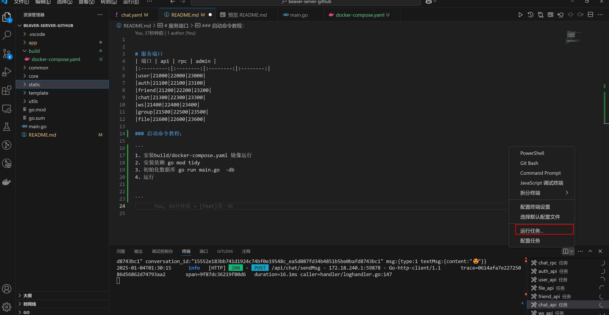
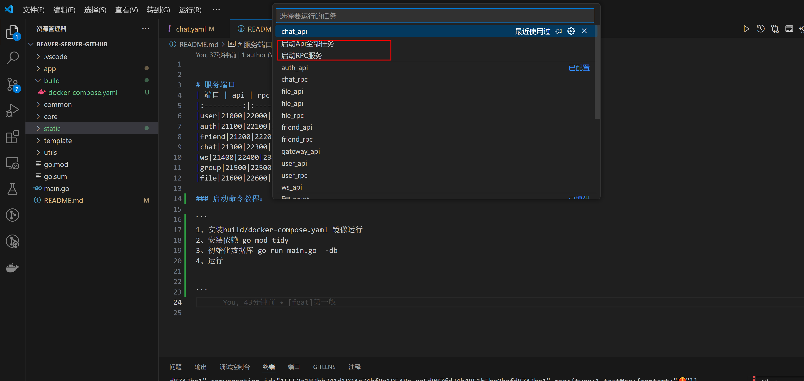
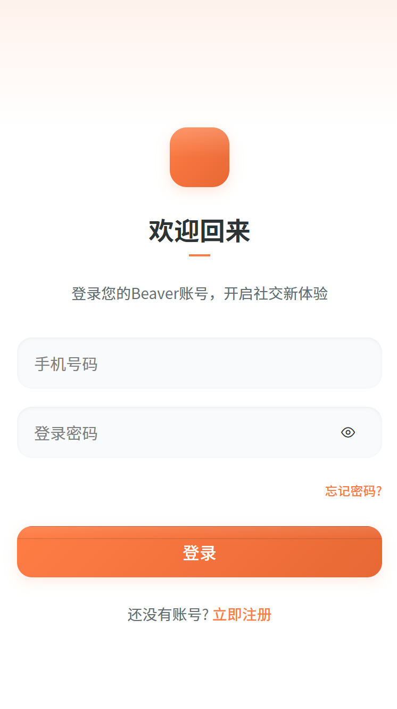
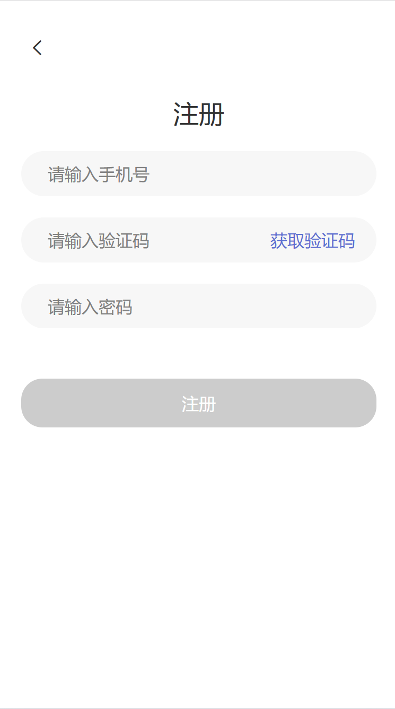
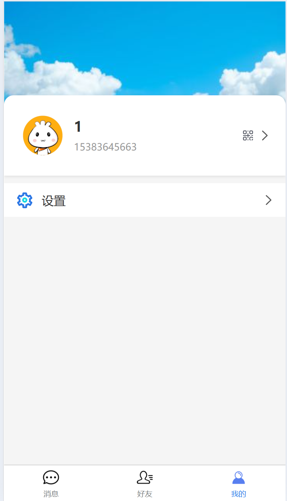
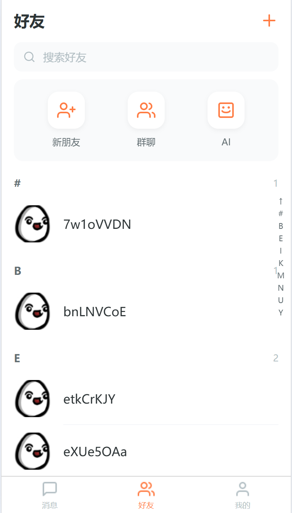
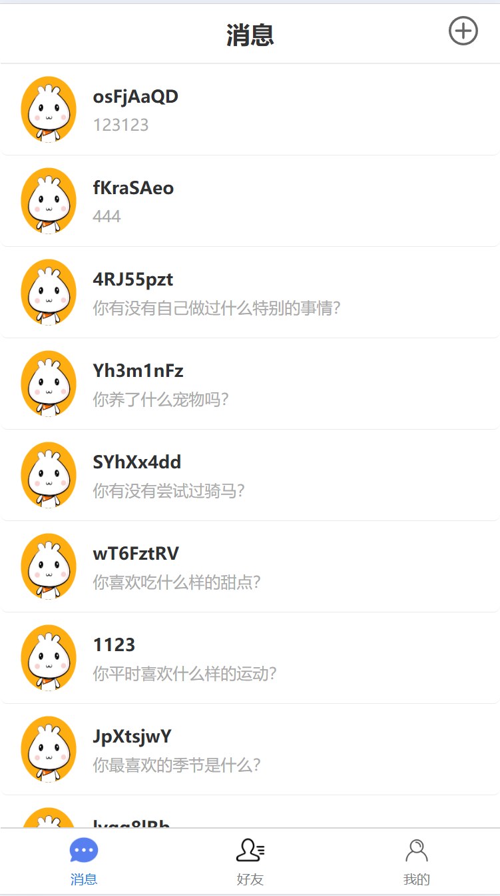
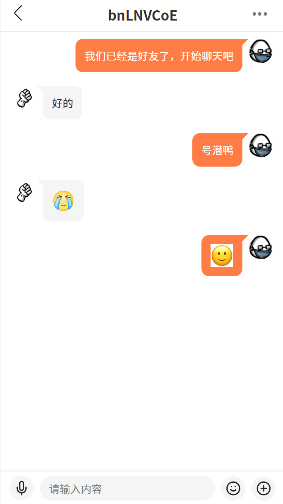
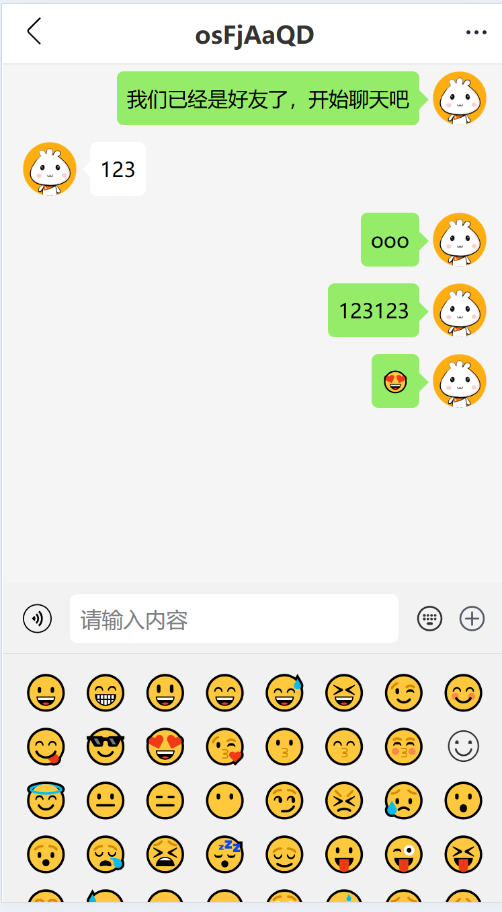
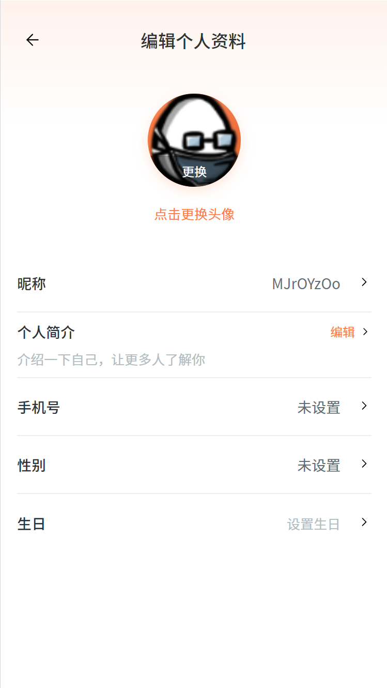

# 服务端口
| 端口 | api | rpc | admin |
|:---------:|:--------:|:--------:|:--------:|
|user|21000|22000|23000|
|auth|21010|22010|23010|
|friend|21020|22020|23020|
|chat|21030|22030|23030|
|ws|21040|22040|23040|
|group|21050|22050|23050|
|file|21060|22060|23060|
|emoji|21070|22070|23070|
|gateway|21080|-----|23080|
|moment|21090|-----|23090|
|system|21100|-----|23100|
|call|21110|-----|23110|
|settings|21120|-----|23120|
|notification|21140|-----|23140|
|feedback|21150|-----|23150|

### 启动命令教程：

+ 安装etcd、mysql、redis
build/docker-compose.yaml
+ 初始化依赖
go mod tidy
+ 初始化数据库
go run main.go  -db
+ 本地运行
需要先启动RPC服务后在启动API服务

### 项目列表
| [GitHub仓库]    |   [Gitee仓库]    |说明                                                                                      
| ------------------------------------------------------------ | --------------------------------------------------------------------------|--------------------------------------------------------------------------|
| [beaver-server](https://github.com/wsrh8888/beaver-server)               |[beaver-server](https://gitee.com/dawwdadfrf/beaver-server)               | 后端服务  |
| [beaver-mobile](https://github.com/wsrh8888/beaver-mobile)        | [beaver-mobile](https://gitee.com/dawwdadfrf/beaver-mobile)               |手机端 |
| [beaver-desktop](https://github.com/wsrh8888/beaver-desktop)        | [beaver-desktop](https://gitee.com/dawwdadfrf/beaver-desktop)               |桌面端 |

### 更新记录
20250422
- 1、增加反馈功能
- 2、增加群聊功能
- 3、优化各种bug
- 4、头像变更为id服务端做转发
- 5、go-zero版本升级
- 6、好友模块优化
- 7、最近会话列表优化

20250119
- 1、修改部分属性字段比如Id变更为ID
- 2、修改user表中的user_id 变更为uuid
- 3、增加朋友圈表以及相关服务
- 4、增加表情包表以及相关服务
- 5、ws服务重构，拆分为不同的模块
- 6、增加group表以及相关服务

### 应用截图

登录界面

注册界面界面

我的界面

我的二维码

好友列表

消息页面

聊天页面

聊天页面

详情页面

