# 🦫 Beaver IM - 企业级即时通讯平台

[](LICENSE)
[](https://golang.org/)
[](https://github.com/zeromicro/go-zero)
[]()
[]()
[](https://github.com/wsrh8888/beaver-server/stargazers)

> 🚀 **企业级即时通讯平台** - 基于Go-Zero微服务架构构建，支持移动端（UniApp）、桌面端（Electron）和Web端，提供实时通信能力。

[English](README_EN.md) | [中文](README.md)

---

## 🌟 核心特性

### 🔐 **企业级安全**
- **多因子认证** - 邮箱验证、短信验证码、生物识别支持
- **端到端加密** - 消息传输和存储加密
- **基于角色的访问控制** - 细粒度权限管理和管理员控制
- **审计日志** - 全面的安全事件追踪

### 💬 **高级消息功能**
- **实时通信** - 基于WebSocket的即时消息
- **多格式支持** - 文本、图片、文件、语音消息、表情
- **消息状态** - 已读回执、正在输入提示、送达确认
- **消息搜索** - 全文本对话搜索
- **消息撤回** - 限时消息删除

### 👥 **社交功能**
- **联系人管理** - 二维码扫描、联系人导入导出
- **群组管理** - 创建、管理和审核群聊
- **好友请求** - 带自定义消息的审批流程
- **用户资料** - 丰富的个人资料信息和头像

### 🏗️ **微服务架构**
- **15+微服务** - 可扩展、可维护的服务分解
- **高可用性** - 多实例部署支持
- **服务发现** - 基于ETCD的服务注册
- **负载均衡** - 智能请求分发
- **熔断器** - 故障容忍和弹性

### 📱 **跨平台支持**
- **移动应用** - 通过UniApp框架支持iOS/Android
- **桌面应用** - 通过Electron支持Windows/macOS/Linux
- **Web客户端** - 渐进式Web应用（PWA）
- **API网关** - 第三方集成的RESTful API

## 🛠️ 技术栈

### 后端服务
| 技术 | 版本 | 用途 |
|------|------|------|
| **Go-Zero** | v1.6.0+ | 微服务框架 |
| **gRPC** | v1.58+ | 服务间通信 |
| **WebSocket** | - | 实时消息 |
| **MySQL** | 8.0+ | 主数据存储 |
| **Redis** | 6.0+ | 缓存和会话管理 |
| **ETCD** | 3.5+ | 服务发现和配置 |
| **Docker** | 20.0+ | 容器化 |

### 前端技术
| 平台 | 框架 | 特性 |
|------|------|------|
| **移动端** | UniApp + Vue 3 | 跨平台移动应用 |
| **桌面端** | Electron + Vue 3 | 原生桌面体验 |
| **Web端** | Vue 3 + PWA | 渐进式Web应用 |

## 📊 性能指标

- **消息延迟**: 平均 < 100ms
- **并发用户**: 支持 10,000+
- **消息吞吐量**: 100,000+ 消息/秒
- **可用性**: 99.9% 正常运行时间
- **响应时间**: API响应 < 200ms

## 🏗️ 架构概览

```
┌─────────────────┐    ┌─────────────────┐    ┌─────────────────┐
│   移动端应用     │    │   桌面端应用     │    │   Web客户端     │
│   (UniApp)      │    │   (Electron)    │    │    (Vue 3)      │
└─────────┬───────┘    └─────────┬───────┘    └─────────┬───────┘
          │                      │                      │
          └──────────────────────┼──────────────────────┘
                                 │
                    ┌─────────────┴─────────────┐
                    │      API网关              │
                    │      (端口: 20800)        │
                    └─────────────┬─────────────┘
                                  │
        ┌─────────────────────────┼─────────────────────────┐
        │                         │                         │
┌───────▼────────┐    ┌───────────▼──────────┐    ┌────────▼────────┐
│   认证服务      │    │    用户服务           │    │   好友服务      │
│   API:20100    │    │   API:20000          │    │  API:20200      │
│   RPC:30100    │    │   RPC:30000          │    │  RPC:30200      │
└────────────────┘    └──────────────────────┘    └─────────────────┘
        │                         │                         │
┌───────▼────────┐    ┌───────────▼──────────┐    ┌────────▼────────┐
│   聊天服务      │    │    群组服务          │    │   文件服务      │
│   API:20300    │    │   API:20500          │    │  API:20600      │
│   RPC:30300    │    │   RPC:30500          │    │  RPC:30600      │
└────────────────┘    └──────────────────────┘    └─────────────────┘
        │                         │                         │
┌───────▼────────┐    ┌───────────▼──────────┐    ┌────────▼────────┐
│   WS服务       │    │   表情服务           │    │ 反馈服务        │
│   API:20400    │    │   API:20700          │    │  API:21400      │
│   RPC:30400    │    │   RPC:30700          │    │  -              │
└────────────────┘    └──────────────────────┘    └─────────────────┘
        │
        └─────────────────────────────────────────────────────────────┐
                                                                      │
                    ┌─────────────────────────────────────────────────┴─┐
                    │              数据层                               │
                    │  ┌─────────────┐  ┌─────────────┐  ┌─────────────┐ │
                    │  │    MySQL    │  │    Redis    │  │    ETCD     │ │
                    │  │   (8.0+)    │  │   (6.0+)    │  │   (3.5+)    │ │
                    │  └─────────────┘  └─────────────┘  └─────────────┘ │
                    └───────────────────────────────────────────────────┘
```

## 🚀 快速开始

### 环境要求
- Go >= 1.21
- MySQL >= 8.0
- Redis >= 6.0
- ETCD >= 3.5
- Docker >= 20.0

### 安装步骤

1. **克隆仓库**
```bash
git clone https://github.com/wsrh8888/beaver-server.git
cd beaver-server
```

2. **安装依赖**
```bash
go mod tidy
```

3. **启动基础设施服务**
```bash
# 使用Docker Compose启动MySQL、Redis、ETCD
docker-compose -f build/docker-compose.yaml up -d
```

4. **初始化数据库**
```bash
go run main.go -db
```

5. **启动服务**
```bash
# 先启动RPC服务
go run app/user/user_rpc/userrpc.go -f app/user/user_rpc/etc/userrpc.yaml
go run app/auth/auth_rpc/authrpc.go -f app/auth/auth_rpc/etc/authrpc.yaml
# ... 启动其他RPC服务

# 然后启动API服务
go run app/user/user_api/user.go -f app/user/user_api/etc/user.yaml
go run app/auth/auth_api/auth.go -f app/auth/auth_api/etc/auth.yaml
# ... 启动其他API服务
```

## 📚 文档与资源

- 📖 **详细文档**: [https://wsrh8888.github.io/beaver-docs/](https://wsrh8888.github.io/beaver-docs/)
- 🎥 **视频教程**: [B站频道](https://www.bilibili.com/video/BV1HrrKYeEB4/)
- 📱 **演示包**: [下载 v1.0.0](https://github.com/wsrh8888/beaver-docs/releases/download/v1.0.0/1.0.0.apk)
- 🔧 **API参考**: [Swagger文档](https://wsrh8888.github.io/beaver-docs/api/)
- 🏗️ **架构指南**: [系统设计](https://wsrh8888.github.io/beaver-docs/architecture/)

## 🔗 相关项目

| 项目 | 仓库地址 | 说明 |
|------|----------|------|
| **beaver-server** | [GitHub](https://github.com/wsrh8888/beaver-server) \| [Gitee](https://gitee.com/dawwdadfrf/beaver-server) | 后端微服务 |
| **beaver-mobile** | [GitHub](https://github.com/wsrh8888/beaver-mobile) \| [Gitee](https://gitee.com/dawwdadfrf/beaver-mobile) | 移动端应用 |
| **beaver-desktop** | [GitHub](https://github.com/wsrh8888/beaver-desktop) \| [Gitee](https://gitee.com/dawwdadfrf/beaver-desktop) | 桌面端应用 |

## 📈 最新更新

### v1.0.0 (2025-07-14)
- ✅ **安全增强**: 邮箱认证和验证码功能
- ✅ **新增服务**: 字典API/RPC和文件RPC服务
- ✅ **用户管理**: 个人资料编辑和信息管理
- ✅ **中间件**: 请求日志和认证中间件
- ✅ **Bug修复**: 全面的Bug修复和性能优化
- ✅ **端口优化**: 所有服务的标准化端口分配

## 📱 功能展示

### 🔐 用户认证
<div align="center">
  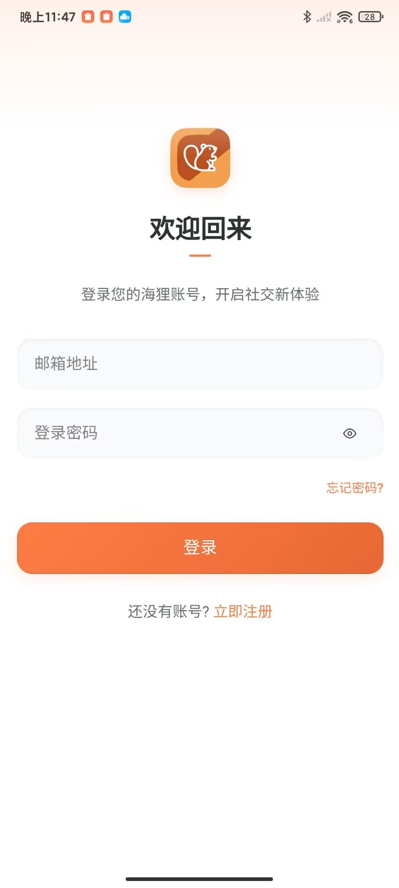
  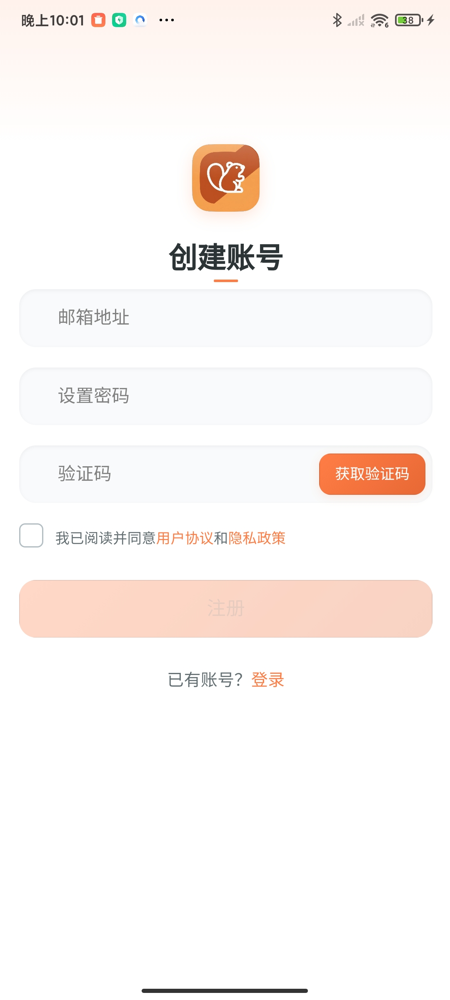
  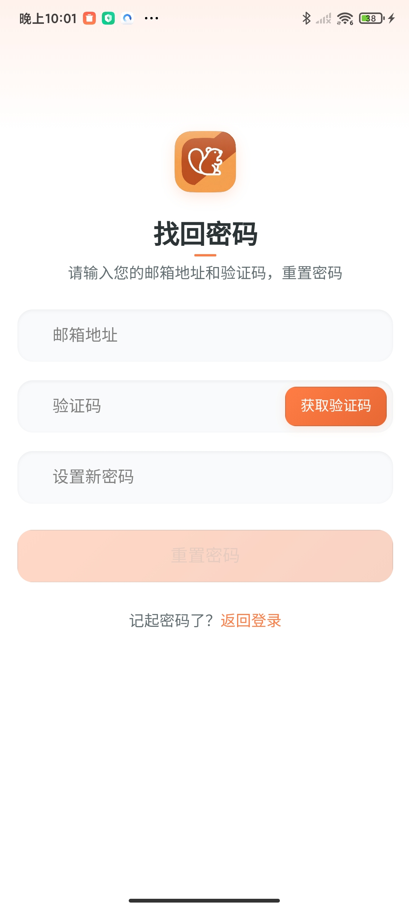
</div>

### 💬 聊天功能
<div align="center">
  
  
  
  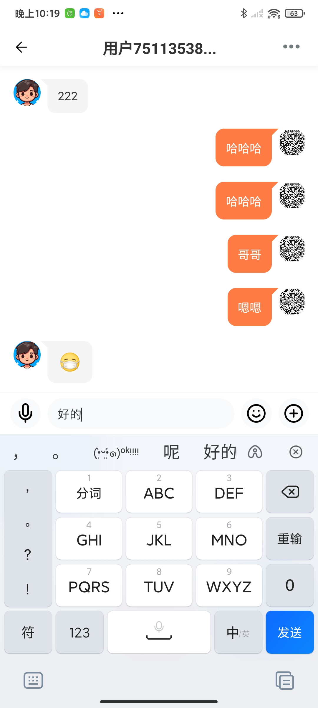
  
  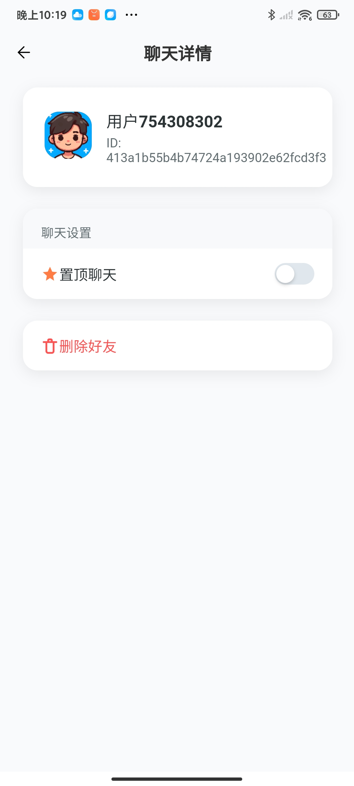
</div>

### 👥 社交功能
<div align="center">
  
  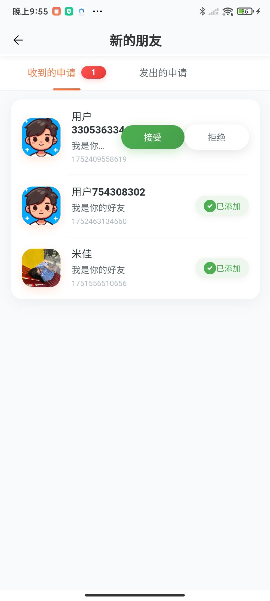
  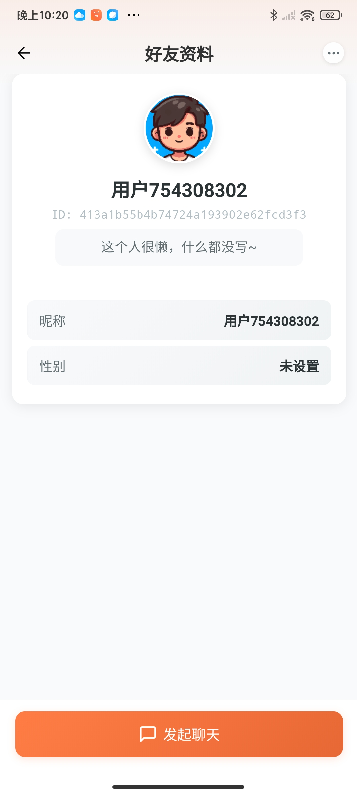
  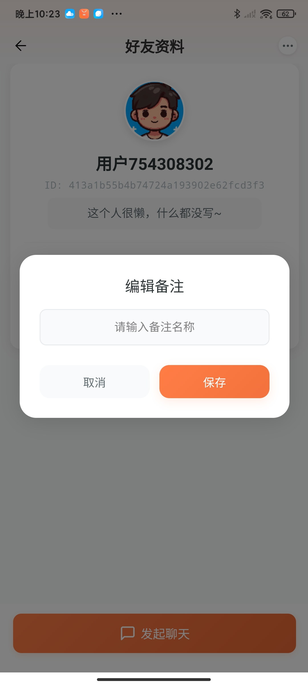
</div>

### 🏠 朋友圈与群组
<div align="center">
  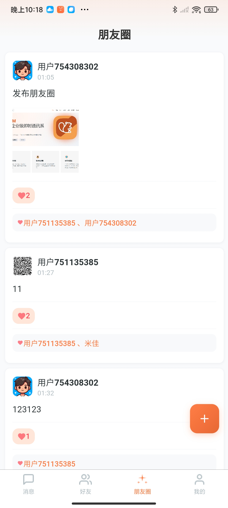
  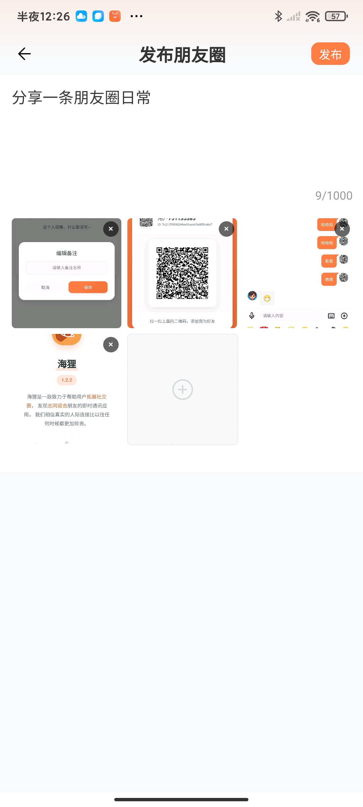
  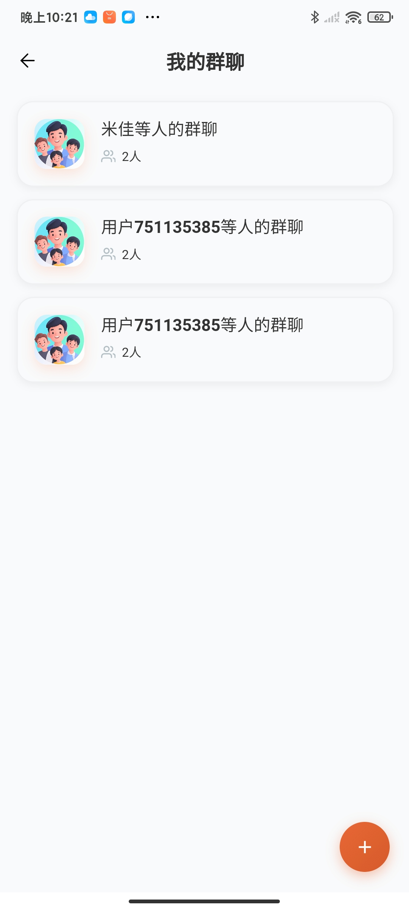
  
  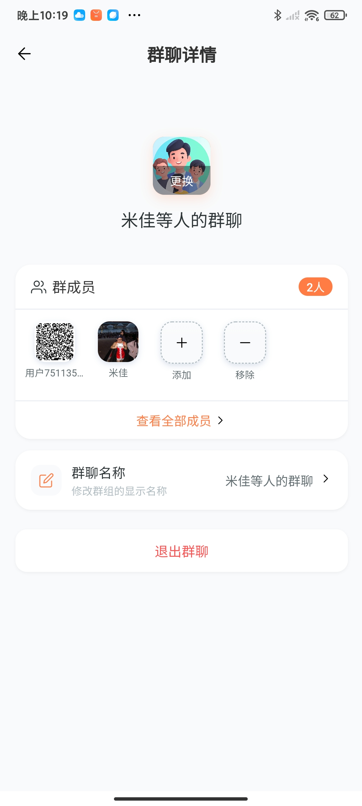
  
</div>

### 👤 个人中心
<div align="center">
  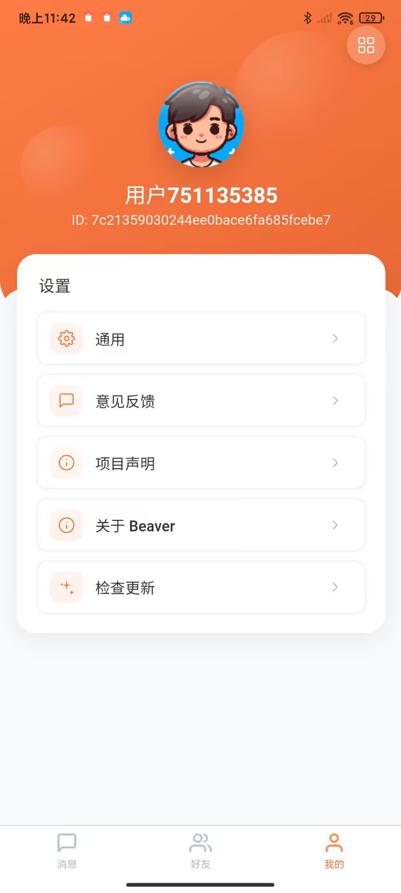
  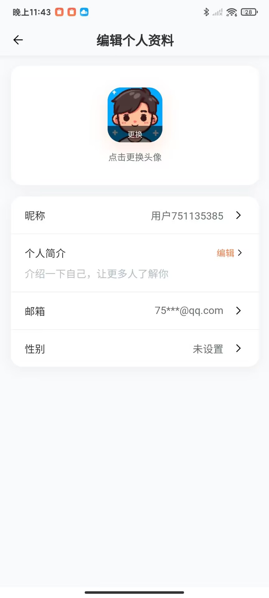
  
</div>

### ⚙️ 系统功能
<div align="center">
  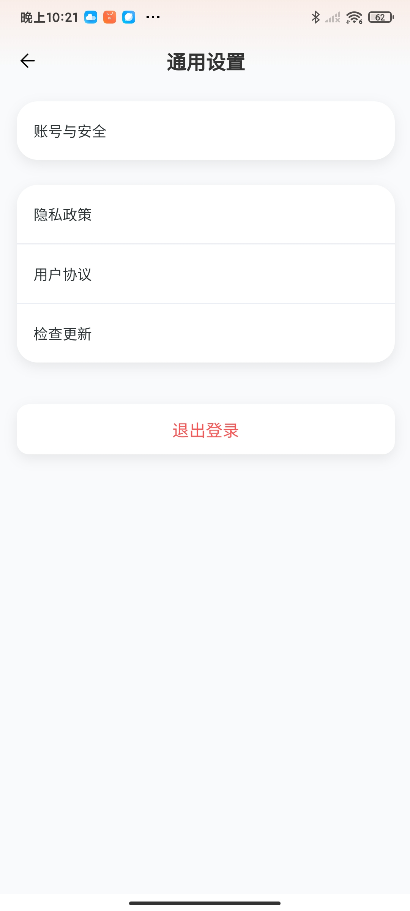
  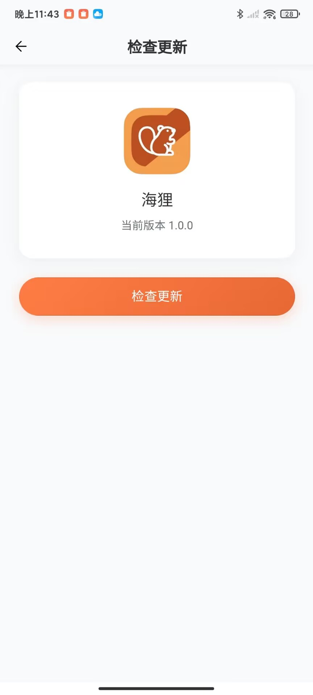
  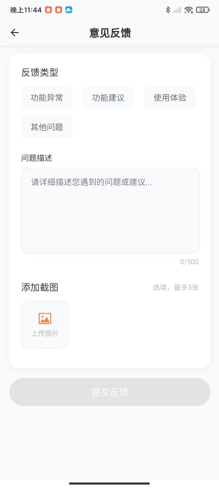
  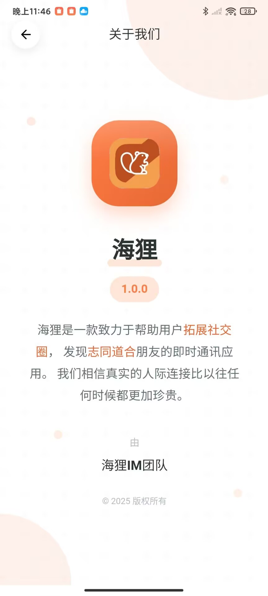
  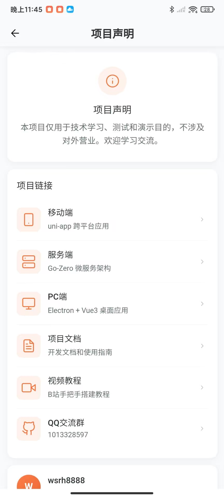
</div>

## 📁 项目结构

```
beaver-server/
├── app/                          # 微服务应用
│   ├── auth/                     # 认证服务
│   │   ├── auth_api/            # HTTP API层
│   │   └── auth_rpc/            # gRPC服务层
│   ├── chat/                     # 聊天服务
│   │   ├── chat_api/            # HTTP API层
│   │   ├── chat_rpc/            # gRPC服务层
│   │   └── chat_models/         # 数据模型
│   ├── friend/                   # 好友管理服务
│   ├── group/                    # 群组管理服务
│   ├── user/                     # 用户管理服务
│   ├── ws/                       # WebSocket服务
│   ├── file/                     # 文件管理服务
│   ├── emoji/                    # 表情管理服务
│   ├── feedback/                 # 反馈服务
│   └── gateway/                  # API网关
├── common/                       # 共享组件
│   ├── middleware/              # HTTP/gRPC中间件
│   ├── models/                  # 共享数据模型
│   ├── response/                # 响应工具
│   └── validator/               # 请求验证
├── core/                        # 核心配置
│   ├── etcd.go                 # ETCD客户端
│   ├── gorm.go                 # 数据库连接
│   └── redis.go                # Redis客户端
├── static/                      # 静态资源
├── template/                    # 代码生成模板
└── utils/                       # 工具函数
```

## 🤝 贡献指南

我们欢迎社区贡献！详情请参阅[贡献指南](CONTRIBUTING.md)。

### 如何贡献

1. **Fork** 本仓库
2. **创建** 特性分支 (`git checkout -b feature/AmazingFeature`)
3. **提交** 更改 (`git commit -m 'Add some AmazingFeature'`)
4. **推送** 到分支 (`git push origin feature/AmazingFeature`)
5. **开启** Pull Request

### 贡献领域

- 🐛 **Bug报告** - 帮助我们识别和修复问题
- 💡 **功能建议** - 建议新功能和改进
- 📝 **文档** - 改进文档和示例
- 🔧 **代码贡献** - 提交代码改进和新功能
- 🧪 **测试** - 帮助测试和质量保证

## 📄 开源协议与免责声明

本项目基于 [MIT](LICENSE) 协议开源 - 详情请参阅 [LICENSE](LICENSE) 文件。

### ⚖️ 法律免责声明

**重要提醒**：本项目仅供学习和合法商业用途使用。使用者应当：

- ✅ **遵守当地法律法规** - 确保使用方式符合所在地区的法律要求
- ✅ **获得必要授权** - 在使用前获得相关方的明确授权
- ✅ **承担使用责任** - 使用者需自行承担因使用本软件而产生的所有法律责任
- ✅ **不得用于非法目的** - 严禁用于诈骗、骚扰、侵犯隐私等违法活动

**免责条款**：
- 本项目开发者不对使用者的行为承担任何法律责任
- 使用者因使用本软件造成的任何损失，开发者不承担责任
- 如发现违法使用行为，请立即停止使用并报告相关执法部门

### 🛡️ 合规使用指南

- 📋 **企业使用**：建议在使用前咨询法务部门
- 🔒 **隐私保护**：确保用户数据收集和使用符合隐私法规
- 📞 **客服支持**：提供合规的客户服务和支持
- 📊 **数据安全**：实施适当的数据安全措施

> 📖 **详细法律条款**：请参阅 [LEGAL.md](LEGAL.md) 文件了解完整的法律免责声明和合规要求。

## 🆘 支持与社区

- 📧 **邮箱**: [751135385@qq.com](mailto:751135385@qq.com)
- 💬 **QQ群**: [1013328597](https://qm.qq.com/q/82rbf7QBzO)
- 📖 **文档**: [https://wsrh8888.github.io/beaver-docs/](https://wsrh8888.github.io/beaver-docs/)
- 🎥 **教程**: [B站频道](https://www.bilibili.com/video/BV1HrrKYeEB4/)
- 🐛 **问题**: [GitHub Issues](https://github.com/wsrh8888/beaver-server/issues)
- 💬 **讨论**: [GitHub Discussions](https://github.com/wsrh8888/beaver-server/discussions)

## ⭐ Star历史

[](https://star-history.com/#wsrh8888/beaver-server&Date)

## ⭐ 支持项目

如果这个项目对你有帮助，请在GitHub上给我们一个 ⭐ Star！

---

<div align="center">
  <strong>Made with ❤️ by Beaver IM Team</strong><br>
  <em>企业级即时通讯平台</em>
</div> 