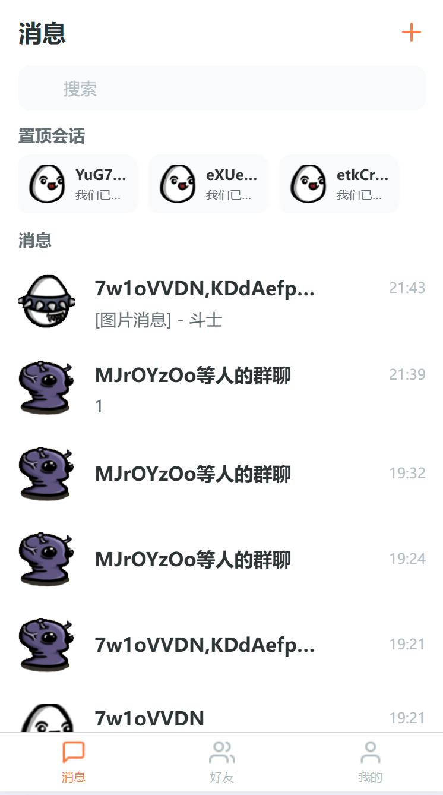
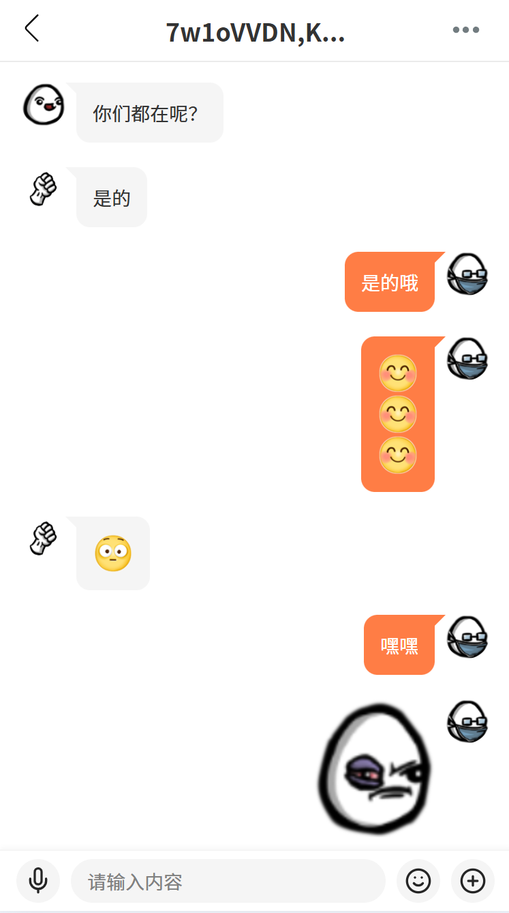
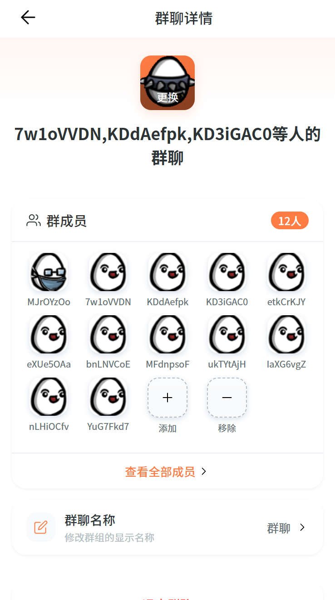
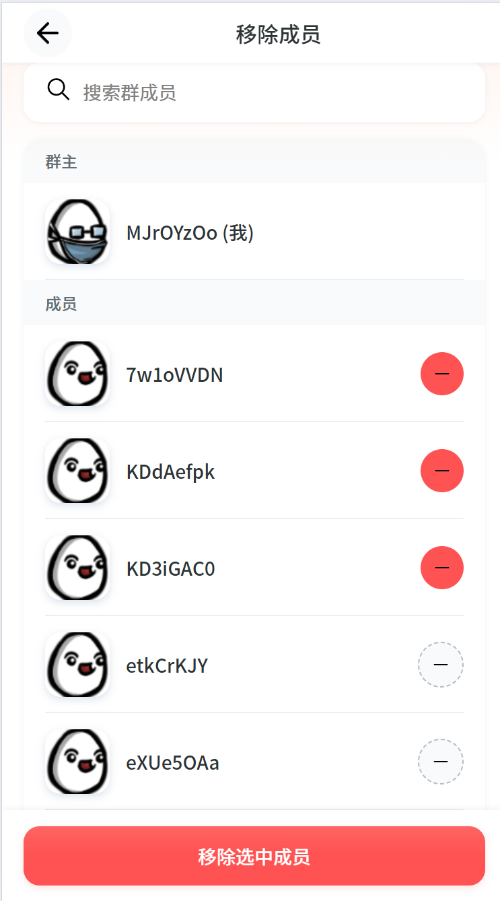
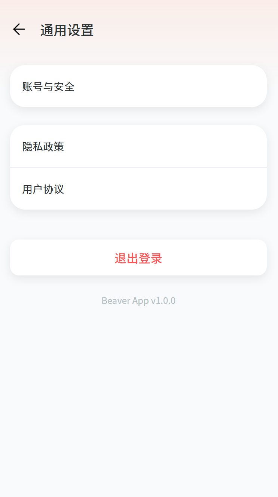
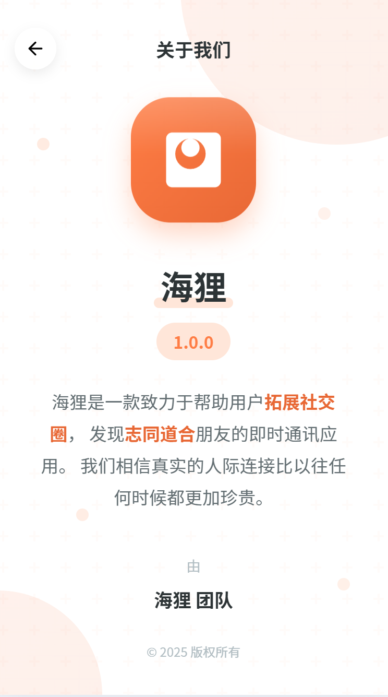
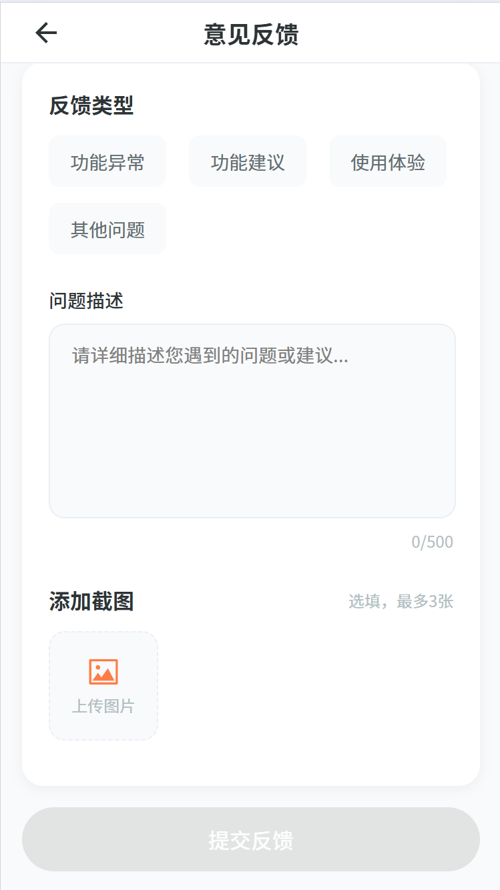

# 海狸IM

### 更新日期
2025-07-14

### 文档地址
https://wsrh8888.github.io/beaver-docs/

### 项目介绍
+ 本项目是利用工作之余做的一个聊天IM。
+  前端使用uniapp， 后端使用go-zero， 桌面端使用electron
+ 如果喜欢可以点一个star
+ 加入QQ群：（1013328597）

# 服务端口（每服务预留100个端口，支持多实例部署）
| 服务 | API基础端口 | RPC基础端口 | Admin基础端口 |
|:---------:|:--------:|:--------:|:--------:|
|user|20000|30000|40000|
|auth|20100|30100|40100|
|friend|20200|30200|40200|
|chat|20300|30300|40300|
|ws|20400|30400|40400|
|group|20500|30500|40500|
|file|20600|30600|40600|
|emoji|20700|30700|40700|
|gateway|20800|-----|40800|
|moment|20900|-----|40900|
|system|21000|-----|41000|
|config|21100|31100|41100|
|feedback|21400|-----|41400|
|track|21500|-----|41500|
|update|21600|-----|41600|

### 启动命令教程：

+ 安装etcd、mysql、redis
build/docker-compose.yaml
+ 初始化依赖
go mod tidy
+ 初始化数据库
go run main.go  -db
+ 本地运行
需要先启动RPC服务后在启动API服务

### 项目列表
| [GitHub仓库]    |   [Gitee仓库]    |说明                                                                                      
| ------------------------------------------------------------ | --------------------------------------------------------------------------|--------------------------------------------------------------------------|
| [beaver-server](https://github.com/wsrh8888/beaver-server)               |[beaver-server](https://gitee.com/dawwdadfrf/beaver-server)               | 后端服务  |
| [beaver-mobile](https://github.com/wsrh8888/beaver-mobile)        | [beaver-mobile](https://gitee.com/dawwdadfrf/beaver-mobile)               |手机端 |
| [beaver-desktop](https://github.com/wsrh8888/beaver-desktop)        | [beaver-desktop](https://gitee.com/dawwdadfrf/beaver-desktop)               |桌面端 |

### 更新记录
20240714
1、修正所有的端口号
2、增加邮箱登录和邮箱验证码
3、增加api和rpc字典服务
4、文件增加rpc服务
5、增加修改个人信息等接口
6、增加请求中间件
7、修复各种bug

### 应用截图

登录界面

注册界面界面

我的界面

我的二维码

好友列表

消息页面

聊天页面

群聊页面

群聊详情

群聊移除界面

详情页面

设置页面

关于页面

问题反馈

