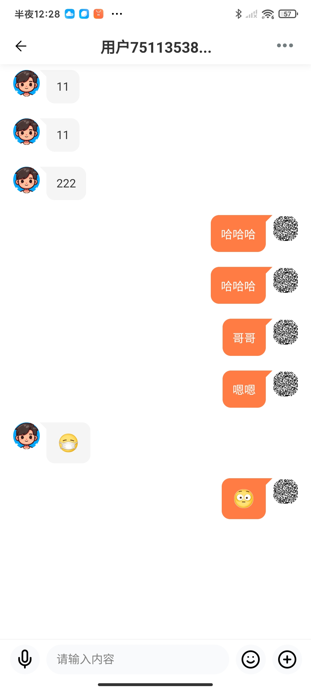
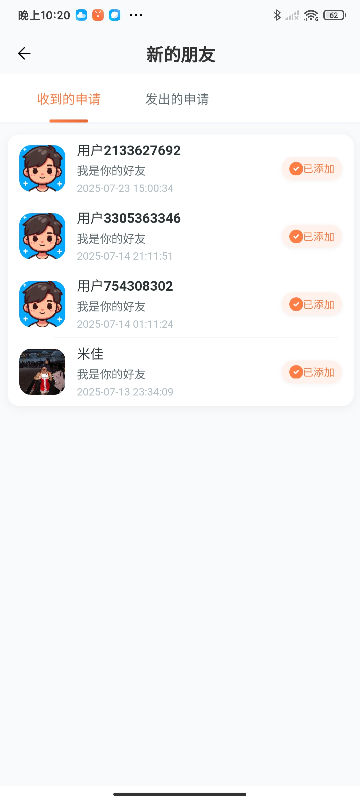
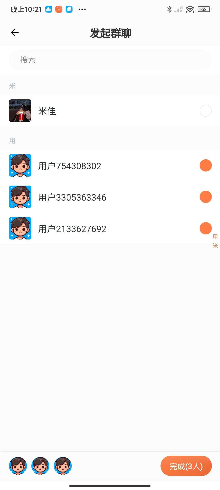
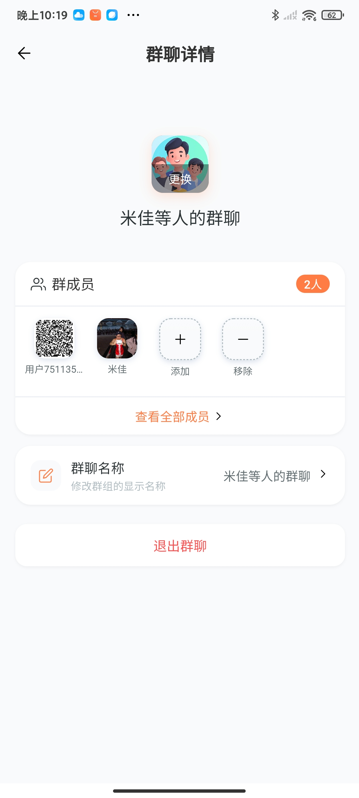
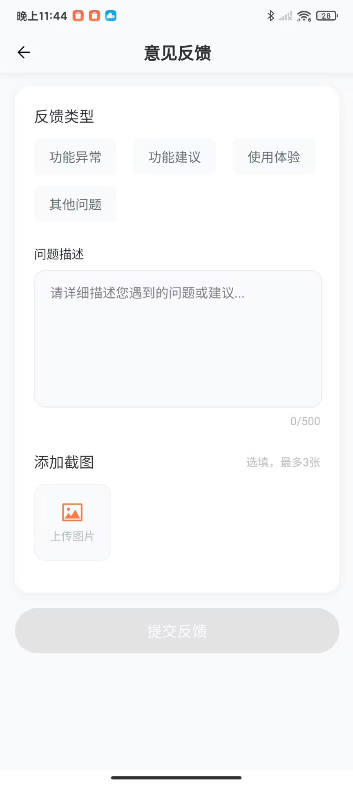

# 🦫 Beaver IM - Enterprise-Grade Instant Messaging Platform

[](LICENSE)
[](https://golang.org/)
[](https://github.com/zeromicro/go-zero)
[]()
[]()
[](https://github.com/wsrh8888/beaver-server/stargazers)

> 🚀 **Enterprise-Grade Instant Messaging Platform** - Built with Go-Zero microservices, supporting mobile (UniApp), desktop (Electron), and web clients with real-time communication capabilities.

[English](README_EN.md) | [中文](README.md)

---

## 🌟 Key Features

### 🔐 **Enterprise Security**
- **Multi-factor Authentication** - Email verification, SMS codes, biometric support
- **End-to-End Encryption** - Message encryption in transit and at rest
- **Role-Based Access Control** - Granular permissions and admin management
- **Audit Logging** - Comprehensive security event tracking

### 💬 **Advanced Messaging**
- **Real-time Communication** - WebSocket-based instant messaging
- **Multi-format Support** - Text, images, files, voice messages, emojis
- **Message Status** - Read receipts, typing indicators, delivery confirmation
- **Message Search** - Full-text search across conversations
- **Message Recall** - Time-limited message deletion

### 👥 **Social Features**
- **Contact Management** - QR code scanning, contact import/export
- **Group Management** - Create, manage, and moderate group chats
- **Friend Requests** - Approval workflow with custom messages
- **User Profiles** - Rich profile information with avatars

### 🏗️ **Microservices Architecture**
- **15+ Microservices** - Scalable, maintainable service decomposition
- **High Availability** - Multi-instance deployment support
- **Service Discovery** - ETCD-based service registration
- **Load Balancing** - Intelligent request distribution
- **Circuit Breaker** - Fault tolerance and resilience

### 📱 **Cross-Platform Support**
- **Mobile Apps** - iOS/Android via UniApp framework
- **Desktop Apps** - Windows/macOS/Linux via Electron
- **API Gateway** - RESTful APIs for third-party integration

## 🛠️ Technology Stack

### Backend Services
| Technology | Version | Purpose |
|------------|---------|---------|
| **Go-Zero** | v1.6.0+ | Microservices framework |
| **gRPC** | v1.58+ | Inter-service communication |
| **WebSocket** | - | Real-time messaging |
| **MySQL** | 8.0+ | Primary data storage |
| **Redis** | 6.0+ | Caching & session management |
| **ETCD** | 3.5+ | Service discovery & config |
| **Docker** | 20.0+ | Containerization |

### Frontend Technologies
| Platform | Framework | Features |
|----------|-----------|----------|
| **Mobile** | UniApp + Vue 3 | Cross-platform mobile apps |
| **Desktop** | Electron + Vue 3 | Native desktop experience |

## 📊 Performance Metrics

- **Message Latency**: < 100ms average
- **Concurrent Users**: 10,000+ supported
- **Message Throughput**: 100,000+ messages/second
- **Uptime**: 99.9% availability
- **Response Time**: < 200ms API response

## 🏗️ Architecture Overview

```
┌─────────────────┐    ┌─────────────────┐
│   Mobile App    │    │  Desktop App    │
│   (UniApp)      │    │   (Electron)    │
└─────────┬───────┘    └─────────┬───────┘
          │                      │
          └──────────────────────┘
                    │
                    ┌─────────────┴─────────────┐
                    │      API Gateway          │
                    │      (Port: 20800)        │
                    └─────────────┬─────────────┘
                                  │
        ┌─────────────────────────┼─────────────────────────┐
        │                         │                         │
┌───────▼────────┐    ┌───────────▼──────────┐    ┌────────▼────────┐
│   Auth Service │    │   User Service       │    │  Friend Service │
│   API:20100    │    │   API:20000          │    │  API:20200      │
│   RPC:30100    │    │   RPC:30000          │    │  RPC:30200      │
└────────────────┘    └──────────────────────┘    └─────────────────┘
        │                         │                         │
┌───────▼────────┐    ┌───────────▼──────────┐    ┌────────▼────────┐
│   Chat Service │    │   Group Service      │    │   File Service  │
│   API:20300    │    │   API:20500          │    │  API:20600      │
│   RPC:30300    │    │   RPC:30500          │    │  RPC:30600      │
└────────────────┘    └──────────────────────┘    └─────────────────┘
        │                         │                         │
┌───────▼────────┐    ┌───────────▼──────────┐    ┌────────▼────────┐
│   WS Service   │    │   Emoji Service      │    │ Feedback Service│
│   API:20400    │    │   API:20700          │    │  API:21400      │
│   RPC:30400    │    │   RPC:30700          │    │  -              │
└────────────────┘    └──────────────────────┘    └─────────────────┘
        │
        └─────────────────────────────────────────────────────────────┐
                                                                      │
                    ┌─────────────────────────────────────────────────┴─┐
                    │              Data Layer                          │
                    │  ┌─────────────┐  ┌─────────────┐  ┌─────────────┐ │
                    │  │    MySQL    │  │    Redis    │  │    ETCD     │ │
                    │  │   (8.0+)    │  │   (6.0+)    │  │   (3.5+)    │ │
                    │  └─────────────┘  └─────────────┘  └─────────────┘ │
                    └───────────────────────────────────────────────────┘
```


## 📚 Documentation & Resources

- 📖 **Comprehensive Documentation**: [https://wsrh8888.github.io/beaver-docs/](https://wsrh8888.github.io/beaver-docs/)
- 🎥 **Video Tutorials**: [Bilibili Channel](https://space.bilibili.com/269553626/lists)
- 📱 **Demo APK**: [Beaver IM Android Demo](https://github.com/wsrh8888/beaver-docs/releases/download/lastest/latest.apk)
- 💬 **QQ Group**: [1013328597](https://qm.qq.com/q/82rbf7QBzO)

## 🔗 Related Projects

| Project | Repository | Description |
|---------|------------|-------------|
| **beaver-server** | [GitHub](https://github.com/wsrh8888/beaver-server) \| [Gitee](https://gitee.com/dawwdadfrf/beaver-server) | Backend microservices |
| **beaver-mobile** | [GitHub](https://github.com/wsrh8888/beaver-mobile) \| [Gitee](https://gitee.com/dawwdadfrf/beaver-mobile) | Mobile applications |
| **beaver-desktop** | [GitHub](https://github.com/wsrh8888/beaver-desktop) \| [Gitee](https://gitee.com/dawwdadfrf/beaver-desktop) | Desktop applications |


## 📱 Feature Showcase

### 🔐 Authentication & Security
<div align="center">
  
  
  
</div>

### 💬 Messaging & Communication
<div align="center">
  
  
  
  
  
  
</div>

### 👥 Social Features
<div align="center">
  
  
  
  
</div>

### 🏠 Moments & Groups
<div align="center">
  
  
  
  
  
  
</div>

### 👤 User Management
<div align="center">
  
  
  
</div>

### ⚙️ System Features
<div align="center">
  
  
  
  
  
</div>

## 📁 Project Structure

```
beaver-server/
├── app/                          # Microservices applications
│   ├── auth/                     # Authentication service
│   │   ├── auth_api/            # HTTP API layer
│   │   └── auth_rpc/            # gRPC service layer
│   ├── chat/                     # Chat service
│   │   ├── chat_api/            # HTTP API layer
│   │   ├── chat_rpc/            # gRPC service layer
│   │   └── chat_models/         # Data models
│   ├── dictionary/               # Dictionary service
│   │   ├── dictionary_api/      # HTTP API layer
│   │   └── dictionary_rpc/      # gRPC service layer
│   ├── feedback/                 # Feedback service
│   │   ├── feedback_api/        # HTTP API layer
│   │   └── feedback_models/     # Data models
│   ├── file/                     # File management service
│   │   ├── file_api/            # HTTP API layer
│   │   ├── file_rpc/            # gRPC service layer
│   │   └── file_models/         # Data models
│   ├── friend/                   # Friend management service
│   │   ├── friend_api/          # HTTP API layer
│   │   ├── friend_rpc/          # gRPC service layer
│   │   └── friend_models/       # Data models
│   ├── gateway/                  # API gateway
│   ├── group/                    # Group management service
│   │   ├── group_api/           # HTTP API layer
│   │   ├── group_rpc/           # gRPC service layer
│   │   └── group_models/        # Data models
│   ├── moment/                   # Moments service
│   │   ├── moment_api/          # HTTP API layer
│   │   └── moment_models/       # Data models
│   ├── user/                     # User management service
│   │   ├── user_api/            # HTTP API layer
│   │   ├── user_rpc/            # gRPC service layer
│   │   └── user_models/         # Data models
│   └── ws/                       # WebSocket service
│       └── ws_api/              # HTTP API layer
├── common/                       # Shared components
│   ├── middleware/              # HTTP/gRPC middleware
│   ├── models/                  # Shared data models
│   ├── response/                # Response utilities
│   └── validator/               # Request validation
├── core/                        # Core configurations
│   ├── etcd.go                 # ETCD client
│   ├── gorm.go                 # Database connection
│   └── redis.go                # Redis client
├── static/                      # Static assets
├── template/                    # Code generation templates
└── utils/                       # Utility functions
```

## 🤝 Contributing

We welcome contributions from the community! Please see our [Contributing Guide](CONTRIBUTING.md) for details.

### How to Contribute

1. **Fork** the repository
2. **Create** a feature branch (`git checkout -b feature/AmazingFeature`)
3. **Commit** your changes (`git commit -m 'Add some AmazingFeature'`)
4. **Push** to the branch (`git push origin feature/AmazingFeature`)
5. **Open** a Pull Request

### Contribution Areas

- 🐛 **Bug Reports** - Help us identify and fix issues
- 💡 **Feature Requests** - Suggest new features and improvements
- 📝 **Documentation** - Improve documentation and examples
- 🔧 **Code Contributions** - Submit code improvements and new features
- 🧪 **Testing** - Help with testing and quality assurance

## 📄 License & Legal Disclaimer

This project is licensed under the [MIT License](LICENSE) - see the [LICENSE](LICENSE) file for details.

### ⚖️ Usage Guidelines

**Project Purpose**: This project is primarily designed for **technical learning and communication**, aiming to provide developers with a platform for learning and research.

**Usage Recommendations**:
- 📚 **Learning & Communication** - Welcome for personal learning, technical research, academic exchange
- 🤝 **Open Source Contributions** - Welcome code improvements, bug fixes, feature suggestions
- 🔒 **Compliant Usage** - Please ensure usage complies with local laws and regulations
- 💡 **Innovative Applications** - Encourage innovative application development based on this project

**Friendly Reminders**:
- This project uses the MIT open source license, allowing you to freely use, modify, and distribute
- We recommend reading relevant laws and regulations before use to ensure compliance
- If you have questions or need help, feel free to reach out via QQ Group or GitHub Issues

### 📋 Project Attribution Requirements

**Important**: If you develop or publish based on this project, you **must** retain the following information:

#### 🖥️ **Frontend Projects (Mobile/Desktop/Web Apps)**
- **About Page**: Must include project source attribution in "About Us", "About App", or similar pages
- **Required Text**: "Based on [Beaver IM](https://github.com/wsrh8888/beaver-server) open source IM project"
- **Link**: Must provide clickable link to the original project

#### 🔧 **Backend Projects (Server/API Services)**
- **README.md**: Must include attribution in the project introduction or description
- **Required Text**: "Based on [Beaver IM](https://github.com/wsrh8888/beaver-server) open source IM project"
- **Link**: Must provide clickable link to the original project

#### 📄 **General Requirements**
- **LICENSE file**: Retain the original project MIT license information
- **Commercial Use**: Company or enterprise-level commercial applications require explicit authorization

> 💡 **Friendly Note**: This project supports both personal learning and personal commercial use. For company or enterprise-level commercial applications, **explicit authorization from us is required** before any commercial use.

> 📖 **Detailed Legal Terms**: Please refer to [LEGAL.md](LEGAL.md) for complete legal disclaimers and usage requirements.

## ⭐ Star History

[](https://star-history.com/#wsrh8888/beaver-server&Date)

## ☕ Buy the Author a Coffee

If this project helps you, welcome to buy the author a coffee ☕

<div align="center">
  
  
</div>

## ⭐ Support the Project

If this project helps you, please give us a ⭐ Star on GitHub!

---

<div align="center">
  <strong>Made with ❤️ by Beaver IM Team</strong><br>
  <em>Enterprise-Grade Instant Messaging Platform</em>
</div>
